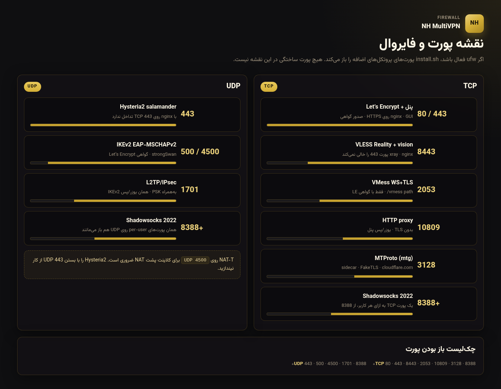
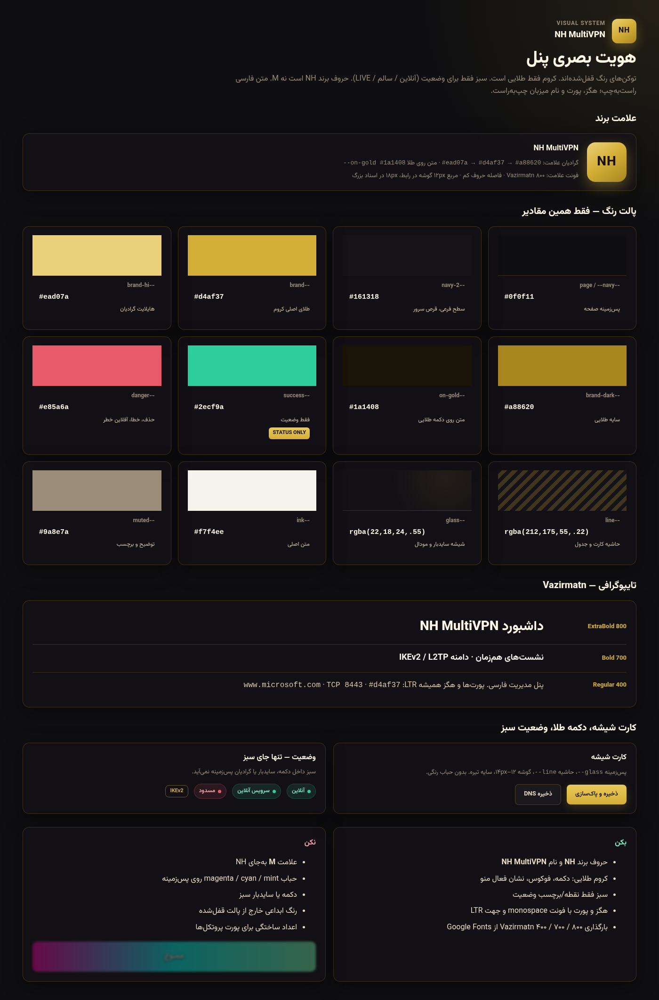

# Multi-VPN Panel

پنل مدیریت فارسی برای VPN روی **Ubuntu 22.04 / 24.04**: IKEv2 (گواهی Let’s Encrypt + EAP-MSCHAPv2)، به‌همراه پشتیبانی اختیاری از **VLESS Reality**، **VMess (WS+TLS)**، **Shadowsocks 2022**، **Hysteria2**، **HTTP proxy** و **MTProto (mtg)** با مدیریت متمرکز کاربر.

## ویکی تصویری

مشخصات پروتکل، پورت و هویت بصری — کامل به‌صورت تصویر. فهرست: [`docs/WIKI.md`](docs/WIKI.md)






## امکانات

- پنل مدیریتی فارسی و واکنش‌گرا با صفحات مستقل داشبورد، کاربران، نشست‌ها، کلاینت‌ها و تنظیمات
- رابط 3x-ui: سایدبار چپ، تم روشن/تیره، FA/EN، پشتیبان/گزارش/ری‌استارت، و تیک IKEv2/L2TP هنگام ساخت کاربر
- یک هویت (نام‌کاربری/رمز) مشترک برای IKEv2، VLESS Reality، VMess، Shadowsocks، Hysteria2، HTTP proxy و MTProto — هرکدام اختیاری، به‌ازای هر کاربر
- کاربر جدید با **تاریخ انقضا** و **حجم (گیگابایت)** مشترک بین همه پروتکل‌ها
- محدودیت تعداد دستگاه هم‌زمان به‌ازای هر کاربر (پیش‌فرض ۱)، روی همه‌ی پروتکل‌ها اعمال می‌شود
- نمایش افراد آنلاین، نشست‌ها، ترافیک
- قطع دستی نشست و پاک‌سازی خودکار نشست‌های قدیمی با سقف قابل‌تنظیم برای هر کاربر
- کد QR و لینک اتصال اختصاصی برای VLESS/VMess/Shadowsocks/Hysteria2/HTTP/MTProto هر کاربر، به‌علاوه لینک اشتراک (subscription) قابل‌به‌روزرسانی
- پردازنده، RAM، بار سیستم
- سرعت لحظه‌ای و مجموع دانلود/آپلود سرور، مشابه پارامترهای nload
- تغییر PSK و دامنه IKEv2 / L2TP از پنل
- DNS تونل
- اسکریپت نصب تعاملی: دامنه، SSL، یوزر پنل، PSK

## پروتکل‌های اضافه

علاوه بر IKEv2 / L2TP، پروتکل‌های زیر با همان کاربر پنل مدیریت می‌شوند. تاریخ انقضا، حجم و محدودیت دستگاه بین‌شان مشترک است.

| پروتکل | سرویس | پورت پیش‌فرض | احراز هویت |
|---|---|---|---|
| VLESS Reality + vision | `panel-shadowsocks.service` (xray-core) | TCP `8443` | UUID + x25519 Reality (بدون Let’s Encrypt) |
| VMess WS+TLS | همان xray | TCP `2053`، path `/vmess` | UUID؛ فقط اگر گواهی LE موجود باشد |
| Shadowsocks 2022 | همان xray | TCP/UDP از `8388` به بالا، یکی برای هر کاربر | کلید `2022-blake3-aes-128-gcm` |
| Hysteria2 | `panel-hysteria.service` | UDP `443` | نام‌کاربری/رمز، همان رمز IKEv2 |
| HTTP proxy | همان xray | TCP `10809` | یوزر/پس پنل؛ بدون TLS |
| MTProto | `panel-mtg.service` (sidecar 9seconds/mtg) | TCP `3128` | یک secret FakeTLS برای کل پنل |

نکته‌ها:

- **VLESS / VMess / Shadowsocks / HTTP داخل یک نمونه‌ی `xray-core` هستند** (`panel-shadowsocks`). Xray ورودی mtproto ندارد؛ MTProto با sidecar `mtg` مثل 3x-ui v3.3 بالا می‌آید.
- VLESS Reality به گواهی دامنه نیاز ندارد. کلیدهای x25519 اولین بار که پنل کانفیگ xray را می‌نویسد ساخته می‌شوند و در `config.json` می‌مانند (`reality_private` / `reality_public` / `reality_short_id`). مقصد پیش‌فرض `www.microsoft.com:443`. لینک‌های قدیمی VLESS+TLS بعد از آپدیت کار نمی‌کنند — UUID همان است، کلاینت باید لینک Reality جدید را بگیرد.
- VMess و Hysteria2 از گواهی Let’s Encrypt دامنه استفاده می‌کنند؛ تا وقتی گواهی نباشد VMess inbound ساخته نمی‌شود و Hysteria2 استارت نمی‌شود.
- Hysteria2 روی UDP است، با nginx روی TCP 443 تداخل ندارد. مبهم‌سازی `salamander`.
- دامنه IKEv2 / L2TP از تنظیمات پنل عوض می‌شود (`leftid` فقط روی `conn IKEv2-EAP`). xl2tpd ری‌استارت نمی‌شود. اگر certbot شکست بخورد دامنه باز هم ذخیره می‌شود.
- کانفیگ‌ها را خود پنل از روی `users.json` می‌سازد — دستی ویرایش نکنید.
- `install.sh` باینری‌های `xray-core`، `hysteria` و `mtg` (v2.2.8) را نصب می‌کند. روی پنل نصب‌شده، `sudo multivpn update` پنل را کپی می‌کند و `EXTRA_ONLY=1` همان باینری/فایروال/یونیت‌ها را بدون قطع تونل IKEv2 اعمال می‌کند.

## نصب

دامنه را از قبل به IP سرور اشاره بده و این پورت‌ها باز باشند:

| پورت | برای |
|---|---|
| TCP 80/443 | پنل، Let’s Encrypt |
| UDP 500/4500/1701 | IKEv2 / L2TP |
| TCP 8443 | VLESS Reality |
| TCP 2053 | VMess WS+TLS |
| TCP 10809 | HTTP proxy |
| TCP 3128 | MTProto (mtg) |
| UDP 443 | Hysteria2 |
| TCP/UDP 8388 به بالا | Shadowsocks (یک پورت برای هر کاربر) |

اگر `ufw` فعال باشد، `install.sh` پورت‌های سه پروتکل اضافه را خودش باز می‌کند.

```bash
git clone https://github.com/navidhaghpanah/multivpn-panel.git
cd multivpn-panel
sudo bash install.sh
```

نصب می‌پرسد:

| سؤال | توضیح |
|---|---|
| Domain | مثلا `vpn.example.com` |
| IP | معمولا خودکار پر می‌شود |
| Email | برای Let’s Encrypt — می‌تواند خالی باشد |
| PSK | کلید L2TP، حداقل ۸ نویسه |
| User/Pass پنل | ورود به GUI |
| اولین کاربر VPN | اختیاری |

نصب غیرتعاملی:

```bash
sudo DOMAIN=vpn.example.com \
  PUBLIC_IP=1.2.3.4 \
  PSK=YourLongPskHere \
  PANEL_USER=admin \
  PANEL_PASS='ChangeMe' \
  VPN_USER=user1 \
  VPN_PASS='ChangeMe' \
  NONINTERACTIVE=1 \
  bash install.sh
```

بعد از نصب: `https://دامنه`

## اتصال کلاینت

بعد از نصب، از داشبورد پنل دانلود کنید (ویندوز zip / آیفون mobileconfig) یا از `/opt/ikev2-l2tp-gui/clients/out/`. قالب‌ها در پوشه [`clients/`](clients/README.md) هستند.

**ویندوز**

- `Install-IKEv2.bat` را با Run as administrator اجرا کنید
- Settings → Network → VPN → IKEv2 → Connect
- یوزر و پس همان کاربر پنل
- اگر RasMan خطای ۱۰۶۲ داد، `Check-Windows.bat` را اجرا کنید؛ استک خراب ویندوز با این اسکریپت تعمیر نمی‌شود

**IKEv2 (آیفون — پیشنهادی)**

- فایل `IKEv2.mobileconfig` را روی گوشی باز کنید → Settings → Profile Downloaded → Install
- یا دستی: نوع IKEv2، Server و Remote ID همان دامنه، Local ID خالی، Certificate: None
- یوزر و پس از پنل

**اندروید**

- اپ strongSwan VPN Client، نوع **IKEv2 EAP (Username/Password)**
- روی سامسونگ داخلی: **IKEv2/IPSec MSCHAPv2** — نه PSK و نه RSA

## مسیر فایل‌ها

| مسیر | نقش |
|---|---|
| `/opt/ikev2-l2tp-gui` | کد پنل |
| `/etc/ikev2-l2tp-gui` | config و ادمین |
| `/var/lib/ikev2-l2tp-gui` | کاربران و ترافیک |
| `/etc/ipsec.conf` `/etc/ipsec.secrets` | strongSwan |
| `/opt/panel-xray` `/etc/panel-xray/config.json` | باینری و کانفیگ VLESS Reality + VMess + SS + HTTP |
| `/opt/panel-hysteria` `/etc/panel-hysteria/config.yaml` | باینری و کانفیگ Hysteria2 |
| `/opt/panel-mtg` `/etc/panel-mtg/mtg.toml` | sidecar MTProto |

حذف پنل: `sudo multivpn uninstall` یا `sudo bash uninstall.sh`
## CLI (update / uninstall)

بعد از نصب، دستور `multivpn` روی سرور است (از هر مسیر):

```bash
sudo multivpn update            # git fetch main، کپی پنل، extra protocols، ری‌استارت GUI — تونل IKEv2 قطع نمی‌شود
sudo multivpn status
sudo multivpn restart
sudo multivpn logs -n 80
sudo multivpn uninstall         # سؤال می‌کند؛ دادهٔ کاربر در /etc و /var/lib می‌ماند
sudo multivpn uninstall --yes
```

اگر پنل قبلاً نصب شده: `sudo bash scripts/multivpn install-cli`

Deploy گیت‌هاب اکشن (`DEPLOY_HOST` / `DEPLOY_USER` / `DEPLOY_SSH_KEY`) وقتی این سه secret ست نباشند skip می‌شود، fail نمی‌شود. تا آن موقع از همین CLI روی VPS آپدیت کن.


## مجوز

MIT
