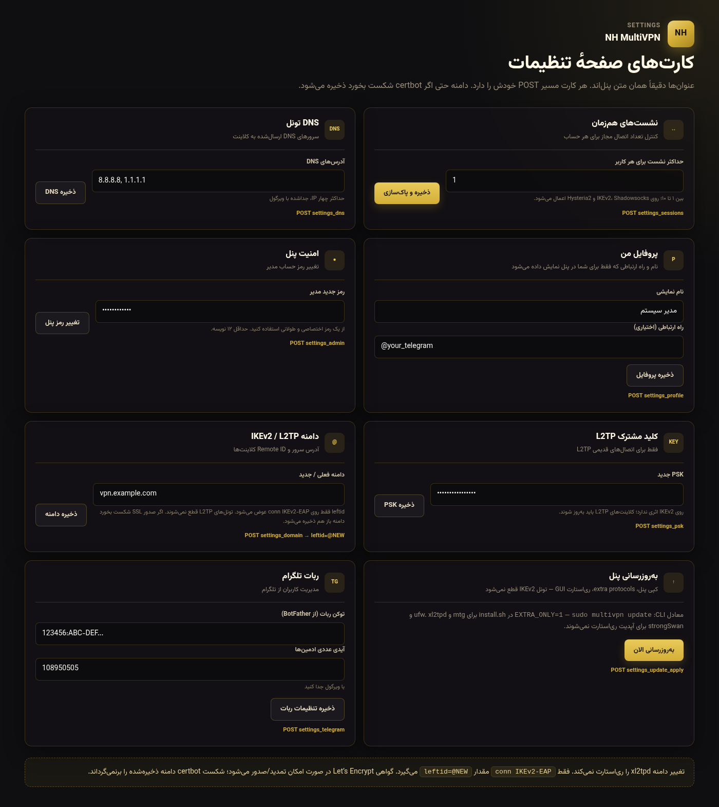
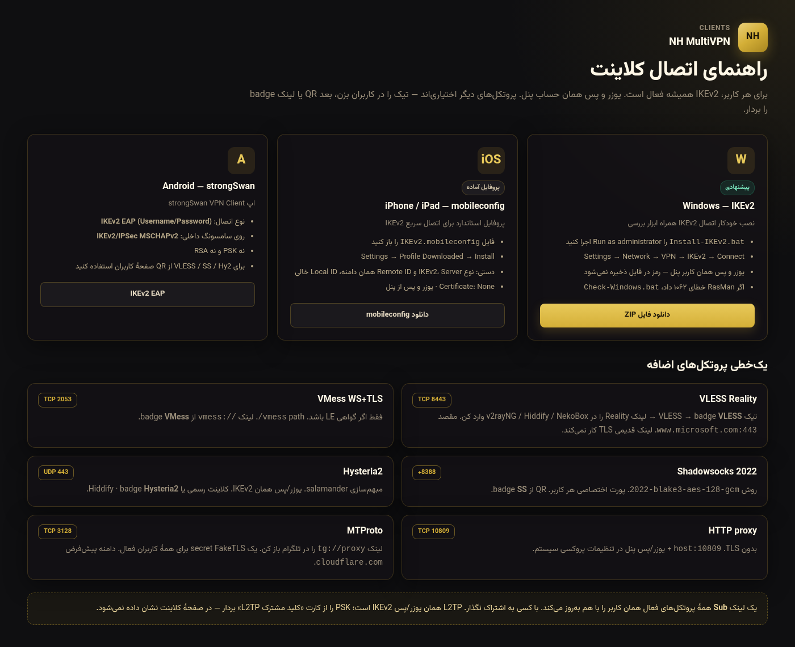
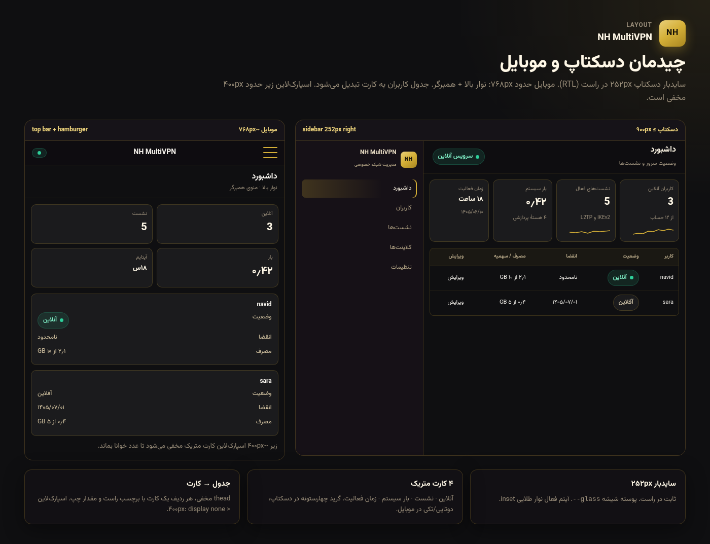
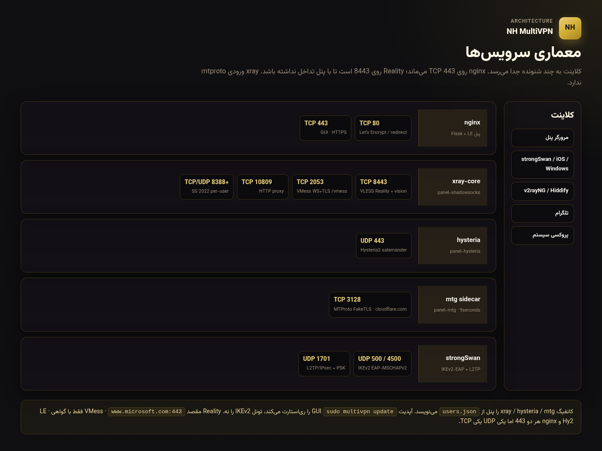

# ویکی تصویری NH MultiVPN

همهٔ مشخصات پروتکل، پورت، ظاهر و چیدمان پنل اینجاست — **به‌صورت تصویر**.  
ویکی گیت‌هاب ممکن است خاموش باشد؛ این فایل همان ویکی است.

- برند: **NH MultiVPN** (حروف علامت **NH** نه M)
- کروم فقط طلایی است. سبز (`#2ecf9a`) فقط وضعیت.
- پورت‌ها اعداد واقعی‌اند، نه تزئینی.

## ظاهر و توکن رنگ

پالت قفل‌شده، Vazirmatn ۴۰۰/۷۰۰/۸۰۰، کارت شیشه، دکمه طلا در برابر وضعیت سبز.

## پروتکل‌ها، پورت و سرویس

VLESS Reality `8443` · VMess WS+TLS `2053` `/vmess` · HTTP `10809` · MTProto mtg `3128` · Shadowsocks 2022 از `8388` · Hysteria2 UDP `443` · IKEv2 UDP `500/4500` · L2TP UDP `1701`.

## نقشه پورت و فایروال

TCP در برابر UDP. پنل و Let’s Encrypt روی `80/443`. اگر `ufw` فعال باشد `install.sh` پورت‌های اضافه را باز می‌کند.

## کارت‌های تنظیمات

عنوان‌ها همان پنل: نشست‌های هم‌زمان، DNS تونل، پروفایل من، امنیت پنل، کلید مشترک L2TP، دامنه IKEv2 / L2TP، به‌روزرسانی پنل، ربات تلگرام.

تغییر دامنه: `POST settings_domain` — دامنه حتی اگر certbot شکست بخورد ذخیره می‌شود؛ فقط `leftid=@NEW` روی `conn IKEv2-EAP`. xl2tpd ری‌استارت نمی‌شود.

آپدیت: `sudo multivpn update` (کپی پنل، `EXTRA_ONLY=1` برای mtg+ufw، ری‌استارت GUI نه IKEv2).

Gateway مدل: فقط HTTPS عمومی؛ localhost، لینک‌لوکال و نشانی‌های خصوصی ذخیره/فراخوانی نمی‌شوند.

## راهنمای کلاینت

ویندوز IKEv2، iOS mobileconfig، اندروید strongSwan، به‌علاوه یک‌خطی VLESS Reality / VMess / SS / Hy2 / HTTP / MTProto.

## چیدمان دسکتاپ و موبایل

سایدبار دسکتاپ **۲۵۲px راست (RTL)**، چهار کارت متریک. موبایل حدود **۷۶۸px**: نوار بالا + همبرگر. جدول کاربران به کارت تبدیل می‌شود. اسپارک‌لاین زیر حدود **۴۰۰px** مخفی است.

## معماری سرویس

nginx `443` · xray `8443/2053/10809/SS` · hysteria UDP `443` · mtg `3128` · strongSwan.

